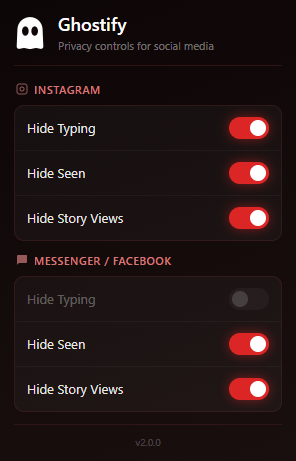

# 👻 Ghostify

> **Control your digital presence on Instagram & Messenger**

A Chrome extension that lets you browse Instagram and Messenger privately by hiding your activity indicators: typing status, read receipts, and story views.


---

## ✨ Features

| Platform | Feature | Status |
|----------|---------|--------|
| **Instagram** | Hide Typing Indicator | ✅ Supported |
| **Instagram** | Hide Read Receipts ("Seen") | ✅ Supported |
| **Instagram** | Hide Story Views | ✅ Supported |
| **Messenger** | Hide Typing Indicator | ❌ Not Supported (Encrypted) |
| **Messenger** | Hide Read Receipts ("Seen") | ✅ Supported |
| **Messenger** | Hide Story Views | ✅ Supported |

---

## 📸 Screenshot

<p align="center">
  
</p>

---

## 🚀 Installation

### From Source (Developer Mode)

1. **Download** or clone this repository
2. Open Chrome and navigate to `chrome://extensions`
3. Enable **Developer mode** (toggle in top-right corner)
4. Click **Load unpacked**
5. Select the `Ghostify 2.0` folder
6. The extension icon will appear in your toolbar

---

## 🎯 How to Use

1. Click the **👻 Ghostify** icon in your Chrome toolbar
2. Toggle features **ON** (red) to hide your activity
3. Toggle features **OFF** (gray) to show your activity normally
4. **Instant Updates:** Settings apply immediately without refreshing

---

## 🏗️ Architecture

```
┌─────────────────────────────────────────────────────────────┐
│                        POPUP (UI)                           │
│  popup.html + popup.js                                      │
│  • User toggles settings                                    │
│  • Saves to chrome.storage.local                            │
└──────────────────────────┬──────────────────────────────────┘
                           │ chrome.storage
┌──────────────────────────▼──────────────────────────────────┐
│                    CONTENT SCRIPT                           │
│  content.js (ISOLATED world)                                │
│  • Reads settings from chrome.storage                       │
│  • Bridges to MAIN world via postMessage                    │
└──────────────────────────┬──────────────────────────────────┘
                           │ window.postMessage
┌──────────────────────────▼──────────────────────────────────┐
│                    GHOST SCRIPT                             │
│  ghost.js (MAIN world)                                      │
│  • Intercepts WebSocket, Fetch, XHR, Beacon                 │
│  • Pattern-matches activity requests                        │
│  • Blocks based on current settings                         │
└─────────────────────────────────────────────────────────────┘
```

### Why Two Worlds?

Chrome MV3 content scripts run in an **ISOLATED** world by default, which cannot access the page's JavaScript context. To intercept network requests, we need to run in the **MAIN** world. However, MAIN world scripts cannot access Chrome APIs like `chrome.storage`.

**Solution:** A bridge pattern where:
- `content.js` (ISOLATED) reads Chrome storage and sends settings via `postMessage`
- `ghost.js` (MAIN) receives settings and intercepts network traffic

---

## 🔧 Technical Details

### Network Interception

The extension intercepts four types of network communication:

| Method | How it's intercepted |
|--------|---------------------|
| **WebSocket** | Prototype patching of `WebSocket.send()` |
| **Fetch API** | Override of `window.fetch()` |
| **XMLHttpRequest** | Prototype patching of `open()` and `send()` |
| **Beacon API** | Override of `navigator.sendBeacon()` |

### Pattern Matching

Activity requests are identified by pattern matching against known Instagram/Messenger API signatures:

- **Typing:** `indicate_activity`, `typing_indicator`, `activity_indicator`, `is_typing`
- **Seen:** `mark_read`, `mark_seen`, `DirectMarkAsSeen`, etc.
- **Stories:** `StoriesUpdateSeenMutation`, `reelMediaSeen`, etc.

### Visibility Spoofing

The extension employs a dual-strategy to prevent "Seen" receipts:

1. **Focus Spoofing:** Dynamically spoofs `document.hasFocus()` to return `false` when blocking is enabled
2. **Event Blocking:** Intercepts `EventTarget.addEventListener` to block the page from attaching `visibilitychange`, `blur`, and `focus` event listeners

---

## 📁 File Structure

```
Ghostify 2.0/
├── manifest.json      # Extension configuration (MV3)
├── popup.html         # Settings UI
├── popup.js           # Settings logic & storage
├── content.js         # Bridge script (ISOLATED world)
├── ghost.js           # Interception logic (MAIN world)
└── README.md          # This file
```

---

## ⚠️ Known Limitations

1. **Messenger Typing:** Cannot be blocked due to end-to-end encryption
2. **Platform Updates:** Meta may change their API, requiring pattern updates
3. **Existing Connections:** WebSocket connections established before extension load may not be intercepted

---

## 🛡️ Privacy

This extension:
- ✅ Runs entirely locally in your browser
- ✅ Does not collect or transmit any data
- ✅ Does not require any external servers
- ✅ Only accesses Instagram, Messenger, and Facebook domains
- ✅ Open source - inspect the code yourself

---

## 📄 License

MIT License - feel free to use, modify, and distribute.

---

## 👤 Author

Built with ☕ and determination.

---

## 🤝 Contributing

Contributions are welcome! If Meta updates their API and breaks something, feel free to submit a PR with updated patterns.

---

*Disclaimer: This extension is for personal privacy use only. Use responsibly and in accordance with platform terms of service.*
